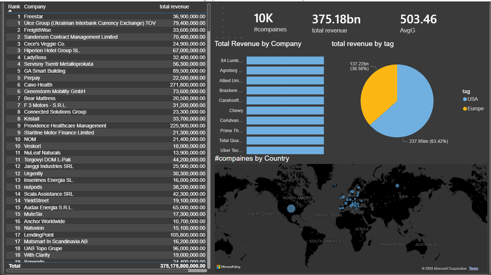

# USA & Europe Company Analysis | Power BI

## Project Overview
This project analyzes company data from the USA and Europe using Power BI.

The dashboard provides insights into:
- Total Revenue
- Average Growth
- Company Rankings
- Revenue by Company
- Revenue by Country
- Company Distribution by Country

---

## Data Cleaning & Transformation
The following steps were performed using Power Query:

- Appended USA and Europe datasets
- Added a custom column to identify region
- Standardized country names
- Cleaned industry names
- Split revenue values from text
- Converted revenue values into numeric format
- Fixed data types

---

## DAX Measures
Created measures for:
- Total Revenue
- Average Growth
- Total Companies Count

---

## Dashboard Visualizations
- KPI Cards
- Bar Chart
- Pie Chart
- Map Chart
- Ranking Table

---

## Tools Used
- Power BI
- Power Query
- DAX
- Excel
- CSV

---

## Dashboard Preview

---

## Author
Hassan Ashraf
